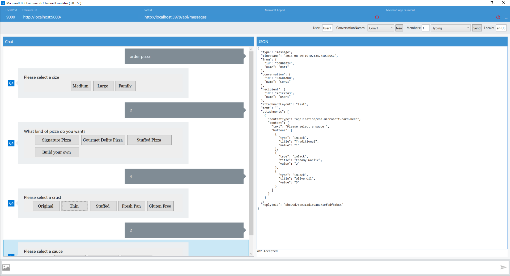

# Lab:  Building a Bot with FormFlow (and LUIS intents)

> The focus of this lab will be on working with FormFlow, a dialog generator, to easily create a conversational model handling a guided conversation.  This is good for a model that has many options and potentially sub-options.  Language Understanding Intelligence Service (LUIS) intents are often combined with FormFlow to detect the intent of the user (e.g. "order" *something* where order could be a different word meaning the same thing).

## Pre-requisites

**Note:  If you have already satisfied the pre-requisites, please move ahead to [FormFlow walk-through](#FormFlow walk-through) below.**

1.	Visual Studio 2015 (Community version is ok) (could use Visual Studio Code on non-Windows systems – however most these instructions are working within a Windows system)
2.	A Microsoft Account to log into the Bot Framework developer portal, which you will use to register your Bot as well as to sign up for Cognitive Services subscriptions (if you have Hotmail, Live, Outlook.com, or an Xbox account then you already have a Microsoft Account).
3.	An Azure account for an Azure-accessible REST endpoint (for registering your bot with the Bot Framework service)
4.	The Bot Framework Emulator
5.	The .NET Bot template
6.	Github and Git Shell for Windows
7.	(Optional) Developer accounts on one or more communication services (such as Facebook) where your Bot will communicate (Skype is already set up for you).
8.	(Optional) An Azure App Insights account to capture telemetry on your bot. 

## Setup

Clone the [`bot-education`](https://github.com/michhar/bot-education) github repository with Windows Git Shell or simply `git`.

## If developing in Node.js and the Node.js Bot Builder SDK (Note, this lab is using the .NET SDK)

Download Node.js Tools for Visual Studio (https://www.visualstudio.com/en-us/features/node-js-vs.aspx) (may need VS 2015 Update 3 - https://www.visualstudio.com/en-us/news/releasenotes/vs2015-update3-vs ) - if developing in Node

### FormFlow walk-through

Adapted from https://github.com/Microsoft/BotBuilder/tree/master/CSharp/Samples/PizzaBot

**Start a new project, select Bot Application, name your project (e.g. MyPizzaBot) and hit OK.**

**From Bot Framework .NET template, perform the following steps to create some supporting class functionality.**

1.  Create a new C# class by right clicking the project name (MyPizzaBot in my case), Add -> New Item... -> Visual C# -> Code -> Class
*  Call this file `PizzaOrderDialog.cs`
*  Copy the code from Bot Builder PizzaBot sample code [here](https://github.com/Microsoft/BotBuilder/blob/master/CSharp/Samples/PizzaBot/PizzaOrderDialog.cs)
*  Modify the namespace to your project name.

Follow the above steps to create `Pizza.cs` using the code from a related file in the sample project [here](https://github.com/Microsoft/BotBuilder/blob/master/CSharp/Samples/PizzaBot/Pizza.cs).

**Next, create a json file to contain pizza options as well as some important values for the LUIS model** 

1.  Create a new folder by right clicking again on project name, Add -> New Folder.  Name this folder `Model`.
*  Create a new json file in `Model` folder by right clicking and going to Visual C# -> Web -> JSON file.  Name the file `PizzaBot.json`
*  Copy the code from [here](https://github.com/Microsoft/BotBuilder/blob/master/CSharp/Samples/PizzaBot/Model/PizzaBot.json) into a new file.

Run from VS
 

This should open a browser window with the endpoint (showing the default.htm file from project) and the port should match the port in the emulator.  Name will be one you gave your project.

Open the Bot Framework Emulator application.  For local testing with the emulator make sure the Id and password fields are clear:
 

Run some test pizza orders (e.g. "order pizza") to see FormFlow (and LUIS intents) in action.

**At this point, feel free to register and publish this bot to your bot directory.**
