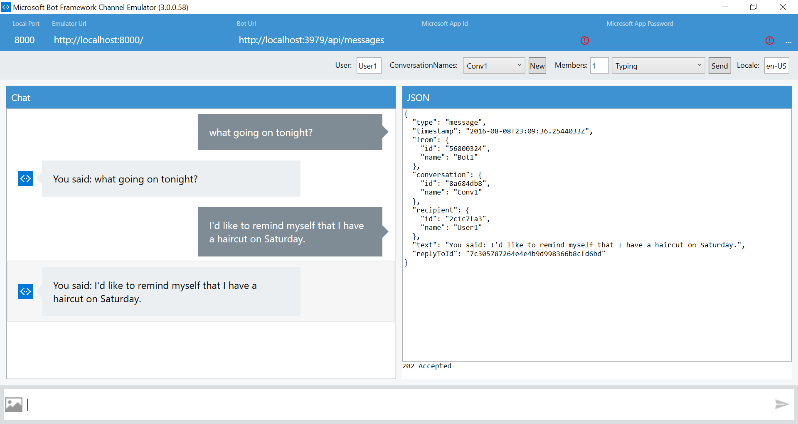
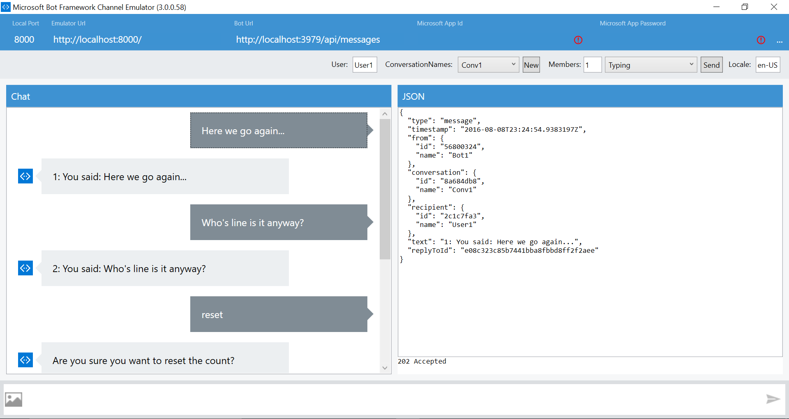
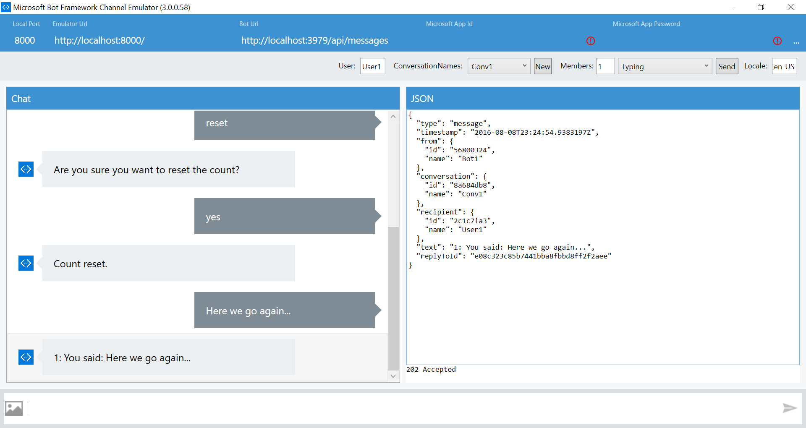
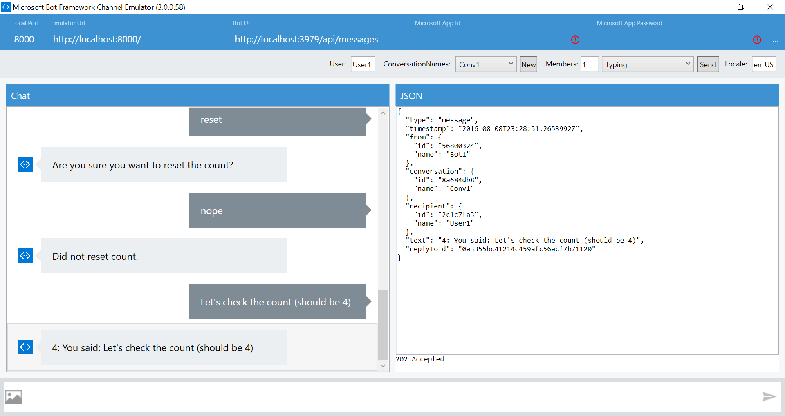

# Lab:  Building your first bot with a Dialog in .NET

## Pre-requisites
1.	Visual Studio 2015 (Community version is ok) (could use Visual Studio Code on non-Windows systems – however most these instructions are working within a Windows system)
2.	A Microsoft Account to log into the Bot Framework developer portal, which you will use to register your Bot as well as to sign up for Cognitive Services subscriptions (if you have Hotmail, Live, Outlook.com, or an Xbox account then you already have a Microsoft Account).
3.	An Azure account for an Azure-accessible REST endpoint (for registering your bot with the Bot Framework service)
4.	The Bot Framework Emulator from the Bot Framework [Downloads](https://docs.botframework.com/en-us/downloads/#navtitle) page.
5.	The Bot Framework Visual Studio Template (C#) from the Bot Framework [Downloads](https://docs.botframework.com/en-us/downloads/#navtitle) page.
6.	Github for Windows (comes with Git Shell)
7.	(Optional) Developer accounts on one or more communication services (such as Facebook) where your Bot will communicate (Skype is already set up for you).
8.	(Optional) An Azure App Insights account to capture telemetry on your bot. 

## Setup


Clone the [`bot-education`](https://github.com/michhar/bot-education) github repository with Windows Git Shell or simply `git`.

## If developing in Node.js and the Node.js Bot Builder SDK

Download Node.js Tools for Visual Studio (https://www.visualstudio.com/en-us/features/node-js-vs.aspx) (may need VS 2015 Update 3 - https://www.visualstudio.com/en-us/news/releasenotes/vs2015-update3-vs ) - if developing in Node

## Getting started
### EchoBot and Dialogs

Adapted from https://docs.botframework.com/en-us/csharp/builder/sdkreference/dialogs.html
This document can also be found on this repository: https://github.com/michhar/bot-education 

### A Simple EchoBot

From Bot Framework .NET template, perform the following steps to add Dialog functionality.
Add this namespace:

`using Microsoft.Bot.Builder.Dialogs;`

Add this class:

```
[Serializable]
    public class EchoDialog : IDialog<object>
    {
        public async Task StartAsync(IDialogContext context)
        {
            context.Wait(MessageReceivedAsync);
        }
        public async Task MessageReceivedAsync(IDialogContext context, IAwaitable<IMessageActivity> argument)
        {
            var message = await argument;
            await context.PostAsync("You said: " + message.Text);
            context.Wait(MessageReceivedAsync);
        }
    }
```

Replace the Post method with this one:

```
public virtual async Task<HttpResponseMessage> Post([FromBody] Activity activity)
        {
            // check if activity is of type message
            if (activity != null && activity.GetActivityType() == ActivityTypes.Message)
            {
                await Conversation.SendAsync(activity, () => new EchoDialog());
            }
            else
            {
                HandleSystemMessage(activity);
            }
            return new HttpResponseMessage(System.Net.HttpStatusCode.Accepted);
        }

```

Run from VS
 


This should open a browser window with the endpoint (showing the default.htm file from project) and the port should match the port in the emulator.


Open the Bot Framework Emulator application.  For local testing with the emulator make sure the Id and password fields are clear:
 


Test out this echo dialog bot.

 



Adding State to the EchoBot

Replace the old EchoDialog with this one:

```
 [Serializable]
    public class EchoDialog : IDialog<object>
    {
        // the state we are persisting with this dialog on each message
        protected int count = 1;


        public async Task StartAsync(IDialogContext context)
        {
            context.Wait(MessageReceivedAsync);
        }

        // we have added check to see if the input was "reset"
        // if that is true we use the built-in Prompts.Confirm dialog to spawn a sub-dialog
        public virtual async Task MessageReceivedAsync(IDialogContext context, IAwaitable<IMessageActivity> argument)
        {
            var message = await argument;
            if (message.Text == "reset")
            {
                // sub-dialog
                PromptDialog.Confirm(
                    context,
                    AfterResetAsync, // result is then passed onto the AfterResetAync method
                    "Are you sure you want to reset the count?",
                    "Didn't get that!",
                    promptStyle: PromptStyle.None);
            }
            else
            {
                await context.PostAsync(string.Format("{0}: You said: {1}", this.count++, message.Text));
                context.Wait(MessageReceivedAsync);
            }
        }

        // check on the response and perform the action including sending a message back to the user
        public async Task AfterResetAsync(IDialogContext context, IAwaitable<bool> argument)
        {
            var confirm = await argument;
            if (confirm)
            {
                this.count = 1;
                await context.PostAsync("Count reset.");
            }
            else
            {
                await context.PostAsync("Did not reset count.");
            }

            // final step is to do IDialogContext.Wait with 
            //     continuation back to MessageReceivedAsync on the next message
            context.Wait(MessageReceivedAsync);
        }
    }   
```

Again, run the code in VS and test in the bot emulator.
 
 
 
 


Extra Credit – AlarmBot

Follow the instructions and code for adding a natural language understanding model (LUIS API) to the EchoBot above in the documentation (https://docs.botframework.com/en-us/csharp/builder/sdkreference/dialogs.html)
