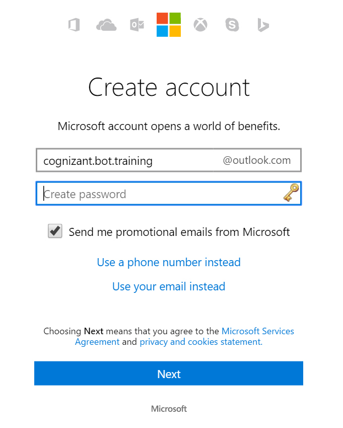
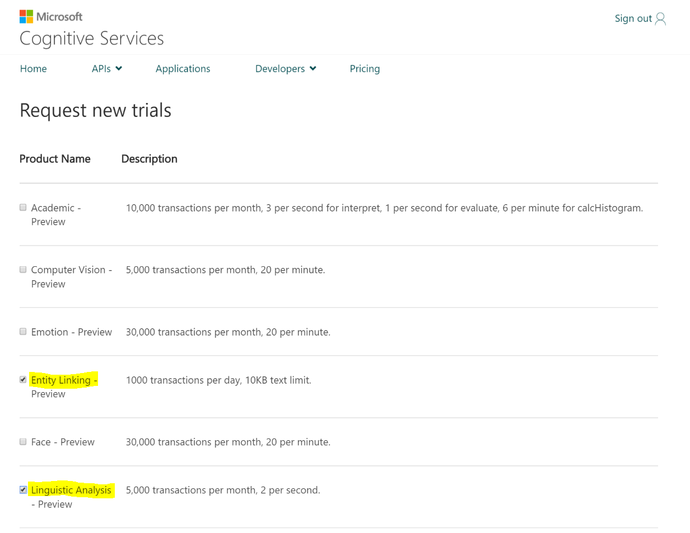

## Cognitive Services Homework
## Pre-Requisites
1.  A Microsoft Account.  If you do not have one, please sign up for one [here](https://account.microsoft.com/about).

## Step 1:  Sign up for Cognitive Services trials
We are going to sign up for two Cognitive Services trial accounts:
* Entity Linking Intelligent Service (ELIS)
* Language Understanding and Intelligent Service (LUIS)
To sign up, follow these instructions:
1.  Go to https://www.microsoft.com/cognitive-services/en-us/apis
*  Click on 'My account' in the upper right-hand corner to log in to Cognitive Services 
*  You will see a 'Hello' welcome page with a listing of trials from which you can request new ones.  Please select 'Entity Linking' and 'Linguistic Analysis'.  .  Read and agree to Microsoft Cognitive Services Terms and Microsoft Privacy Statement.  Click on 'Subscribe'.

