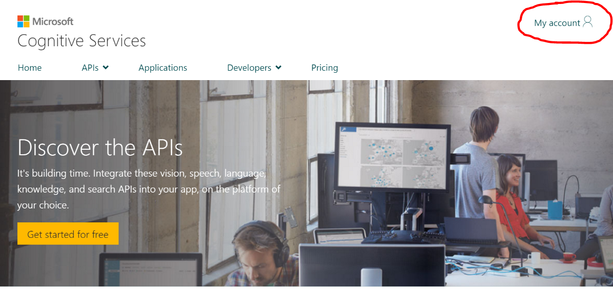
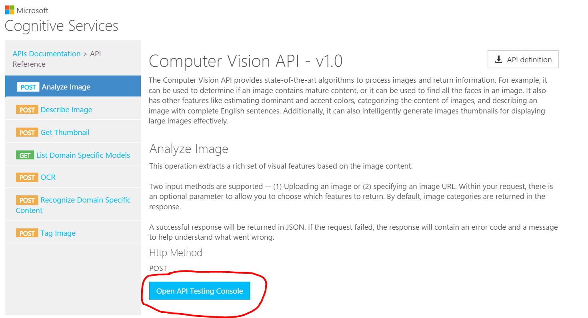

## Cognitive Services Homework
## Pre-Requisites
1.  A Microsoft Account.  If you do not have one, please sign up for one [here](https://account.microsoft.com/about).

## Step 1:  Sign up for Cognitive Services trials

We are going to sign up for two Cognitive Services trial accounts:

* Entity Linking Intelligent Service (ELIS)
* Language Understanding and Intelligent Service (LUIS)

To sign up, follow these instructions:

1.  Go to https://www.microsoft.com/cognitive-services/en-us/apis
*  Click on "My account" in the upper right-hand corner to log in to Cognitive Services. 
*  You will see a 'Hello' welcome page with a listing of trials from which you can request new ones.  Please select "Entity Linking", "Computer Vision", "Emotion", "Face", "Text Analytics" and "Linguistic Analysis".  Read and agree to Microsoft Cognitive Services Terms and Microsoft Privacy Statement.  Click on "Subscribe".
*  
## Step 2:  Open up the API Reference and testing console

1.  Using the upper navigation, click on the "Developers" drop-down menu item and select "Documentation".
2.  "Documentation" should have all of the APIs listed to the left.  Select `Computer Vision API`.  A selection list will expand.
3.  From the expanded list, select `API Reference`.
4.  Here you should see a button "Open API Testing Console".  Click this (shown in red, here).  .

## Step 3:  Analyze an image in the testing console

Here we will formulate our request, send it and look for a response.

